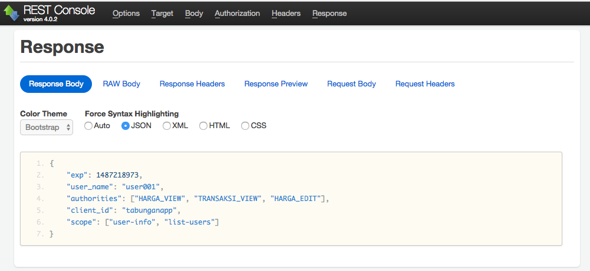

# OAuth 2 dengan Spring #

Beberapa flow grant type yang disediakan:

* Authorization Code
* Implicit
* Password
* Client Credentials

## Authorization Code ##

Cara mengetes flow `authorization-code` :

1. Masuk ke aplikasi `authserver`

        cd authserver

2. Jalankan aplikasi

3. Browse ke url authorization : `http://localhost:10000/oauth/authorize?client_id=tabunganapp&response_type=code&redirect_uri=http://example.com`

    

4. Kita akan disuruh login dulu

    

5. Setelah login, tampil halaman konfirmasi. Lakukan approval

    

6. Redirect ke halaman berikutnya. Kita mendapatkan `authorization-code`

    

7. Tukarkan `authorization-code` dengan `access-token`

	

	

	

	

8. Token bisa dicek di url `check token`

    

	

	

	


## Password ##

Cara setup:

1. Expose `AuthenticationManager` untuk digunakan di OAuth endpoint

	```java
	@Override
    @Bean
    public AuthenticationManager authenticationManagerBean() throws Exception {
        return super.authenticationManagerBean();
    }
	```

2. Gunakan `AuthenticationManager` di OAuth endpoint

	```java
	@Autowired
    @Qualifier("authenticationManagerBean")
    private AuthenticationManager authenticationManager;

	@Override
    public void configure(AuthorizationServerEndpointsConfigurer endpoints) throws Exception {
        endpoints
                .authenticationManager(authenticationManager)
                .accessTokenConverter(jwtAccessTokenConverter());
    }
	```

3. Akses endpoint `oauth/token` dengan client id + secret di Basic Authentication dan username/password di request parameter


	

	

	

4. Kita bisa langsung mendapatkan access token

	
